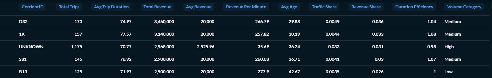

# Public Transportation Data Pipeline (Medallion Architecture)

### 📌 Project Overview

This project builds a data pipeline using the Transjakarta Transportation Transaction dataset from Kaggle.

The pipeline implements a simplified Medallion Architecture:


🥉 Bronze Layer → Raw transaction data

🥈 Silver Layer → Cleaned & validated data

🥇 Gold Layer → Aggregated business metrics & corridor ranking

Dataset Source:
[Transjakarta Transportation Transaction Dataset (Kaggle)](https://www.kaggle.com/datasets/dikisahkan/transjakarta-transportation-transaction)

<hr>

### 🎯 Business Objective

- To analyze corridor-level performance based on:
- Total trips
- Total revenue
- Average trip duration
- Revenue efficiency
- Traffic contribution share
- Volume category (Low / Medium / High)
- The final output ranks corridors based on revenue and trip volume.

<hr>

### 🏗️ Architecture

Raw CSV
<br> ⬇ <br>
Bronze (Raw Load)
<br> ⬇ <br>
Silver (Data Cleaning & Feature Engineering)
<br> ⬇ <br>
Gold (Corridor Aggregation & Ranking)

<hr>

### 🥇 Gold Layer Metrics
For each corridor:
- total_trips
- avg_trip_duration
- total_revenue
- avg_revenue
- revenue_per_minute
- traffic_share
- revenue_share
- duration_efficiency
- volume_category
- Corridors are ranked based on:
- total_revenue (descending)
- total_trips (descending)

<hr>

### 🛠️ Tech Stack
Python <br>
Pandas <br>
SQLAlchemy <br>
PostgreSQL <br>
Kaggle Dataset

<hr>

### 📂 Repository Structure
```
project/
├── data/
├     ├── raw/
├          ├── dfTransjakarta.csv
├── src/
     ├── config.py
     ├── ingestion.py
     ├── silver_to_gold.py
     ├── transform.py
├── docker-compose.yml
├── README.md
└── requirements.txt
```

<hr>

### 🚀 How to Run
Download dataset from Kaggle <br>
Configure database in config.py <br>
Configure docker-compose.yml <br>
Run Docker <br>
Run:
python ingestion.py <br>
python transform.py <br>
python silver_to_gold.py <br>

Gold layer table will be created in the database. <br>

